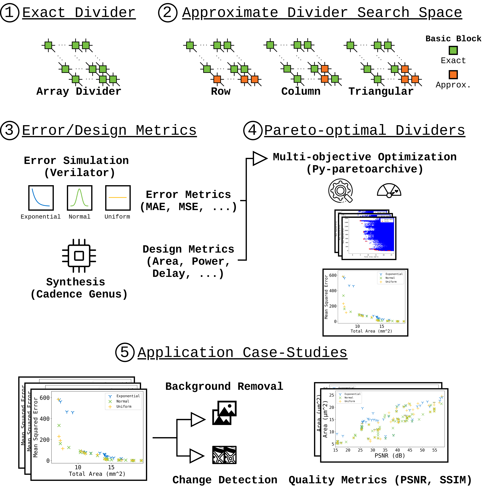

# DIVIAC: Library of Input Data Aware Approximate Dividers with Partial Exact Minimization

<p align="center">
  
</p>

<p align="center">
  
</p>

DIVIAC is a library of approximate divider circuits, which were identified as Pareto-optimal for different input distributions. In DIVIAC we inspected three approximation schemes for restoring array divider circuits and identified possible improvements utilizing exact minimization versus heuristic minimization for basic block structures. Through their approximation scheme, formal verification was employed for the introduced approximation with the cecApprox methodology.

## Project Structure

The `DIVIAC` directory contains subdirectories structured as follows.
First, there are subdirectories for Pareto sets of the exact partial synthesized dividers and the heuristics-based synthesized dividers.
Each directory contains a respective directory for each design-error-metric pair.
For each metric, DIVIAC evaluated input distributions sampled from exponential distributions (e), normal distributions (n), and uniform distributions (u).
The Pareto-optimal circuits are made available in Verilog and Aiger format. 
Each of the directories contains a README file containing the list of Pareto-optimal designs with their respective design metric and error metric.

For example, the Pareto-optimal dividers for area vs. mean average error with exact partial synthesis can be found in `DIVIAC/exact/area-mae/`. 

```
DIVIAC/
├── exact
│   ├── area-mae
│   │   ├── e
│   │   │   ├── aig
│   │   │   └── verilog
│   │   ├── n
│   │   │   ├── aig
│   │   │   └── verilog
│   │   ├── u
│   │   │   ├── aig
│   │   │   └── verilog
│   │   └── README.md
│   ├── area-mse
│   ├── delay-mae
│   ├── delay-mse
│   ├── pwr-mae
│   └── pwr-mse
│   
└── heuristic
    ├── area-mae
    │   ├── e
    │   │   ├── aig
    │   │   └── verilog
    │   ├── n
    │   │   ├── aig
    │   │   └── verilog
    │   ├── u
    │   │   ├── aig
    │   │   └── verilog
    │   └── README.md
    ├── area-mse
    ├── delay-mae
    ├── delay-mse
    ├── pwr-mae
    └── pwr-mse

```

## How to cite

Further details on DIVIAC are described in the following [publication](#tba):

```
@inproceedings{jha2026diviac,
  author = {Jha, Chandan Kumar and Parvin, Sajjad and Ahmadi-Pour, Sallar and Drechsler, Rolf},
  title = {DIVIAC: Library of Input Data Aware Approximate Dividers with Partial Exact Minimization},
  booktitle={2026 39th International Conference on VLSI Design and 2026 25th International Conference on Embedded Systems (VLSID)},
  pages={TBA},
  year={2026},
  organization={IEEE}
}
```

## Acknowledgements

This work was supported by the German Research Foundation (DFG) within the project PLiM (DR 287/35-2 - project number 406079023).

